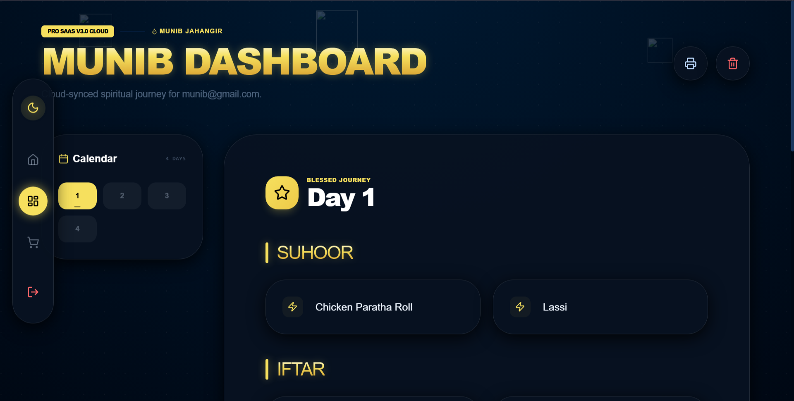
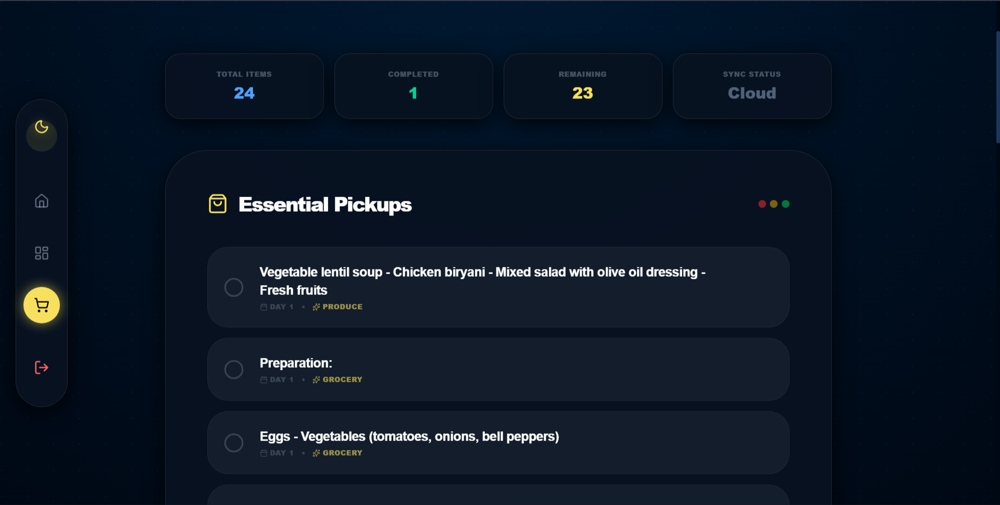
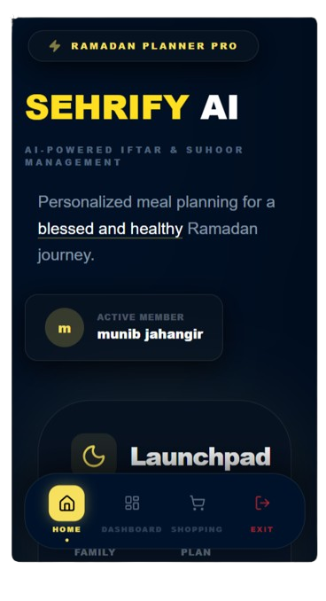

<p align="center">
  
</p>

<h1 align="center">🌙 Sehrify AI - The Ultimate Ramadan Planner</h1>

<p align="center">
  <a href="https://nextjs.org/"></a>
  <a href="https://www.typescriptlang.org/"></a>
  <a href="https://firebase.google.com/"></a>
  <a href="https://capacitorjs.com/"></a>
  <a href="https://opensource.org/licenses/MIT"></a>
</p>


=======
<h1 align="center">🌙 Sehrify AI - The Ultimate Ramadan Planner</h1>

<p align="center">
  <a href="https://nextjs.org/"></a>
  <a href="https://www.typescriptlang.org/"></a>
  <a href="https://firebase.google.com/"></a>
  <a href="https://capacitorjs.com/"></a>
  <a href="https://opensource.org/licenses/MIT"></a>
</p>

<p align="center">
  
</p>
>>>>>>> 75f775a (final build)

**Sehrify AI** is a premium, open-source Ramadan Assistant designed to elevate your spiritual journey. From personalized Iftar and Sehri planning to AI-powered nutrition insights and real-time shopping lists, it’s the only companion you need this Ramadan.

---

## 🖼️ App Screenshots

### 💻 Desktop View
<p align="center">
  
  
  
</p>

### 📱 Mobile View
<p align="center">
  
  
  
</p>

---

## ✨ Key Features

- 🧠 **AI-Powered Planning**: Personalized meal suggestions based on nutritional needs.
- 🕒 **Real-time Schedules**: Accurate Iftar & Sehri timings with beautiful countdowns.
- 🛒 **Smart Shopping List**: Sync your grocery needs effortlessly across devices.
- 🔐 **Secure Auth**: Firebase-powered authentication for personalized data persistence.
- 📱 **Cross-Platform**: Seamless experience on Web and Android (Native APK available).
- 🎨 **Premium UI/UX**: Cinematic glassmorphism design with royal purple and gold aesthetics.

---

## 🚀 Tech Stack

- **Frontend**: Next.js 15 (App Router), TypeScript, Framer Motion, Tailwind CSS
- **Backend/DB**: Firebase (Auth & Firestore)
- **Mobile Foundation**: Capacitor.js
- **Design**: Vanilla CSS & custom micro-animations

---

## 🛠️ Getting Started

### Prerequisites

- Node.js (v18+)
- Java 17 (for Android builds)
- Firebase Account (for database & auth)

### Installation

1. **Clone the repo:**
   ```bash
   git clone https://github.com/Munib-Jahangir/Ramadan-Iftar-and-Sehri-Planner-AI.git
   cd Ramadan-Iftar-and-Sehri-Planner-AI
   ```

2. **Web Setup:**
   ```bash
   cd web
   npm install
   npm run dev
   ```

3. **Android Build:**
   ```bash
   cd ../mobile-app
   npm install
   npm run sync
   npm run build:apk
   ```

---

## 📱 Mobile App (Android)

The app is optimized for Android, featuring:
- **Custom Splash Screen**: Cinematic entry with the Sehrify AI emblem.
- **Easter Egg**: A special tribute to the creator on launch.
- **Offline Readiness**: Fast loading with static export optimization.

Download the latest APK from the [Releases](https://github.com/Munib-Jahangir/Ramadan-Iftar-and-Sehri-Planner-AI/releases) section.

---

## 🤝 Contributing

We love contributions! Whether it's a bug fix, a new feature, or better documentation:
1. Fork the Project.
2. Create your Feature Branch (`git checkout -b feature/AmazingFeature`).
3. Commit your Changes (`git commit -m 'Add some AmazingFeature'`).
4. Push to the Branch (`git push origin feature/AmazingFeature`).
5. Open a Pull Request.

---

## 📄 License

Distributed under the MIT License. See `LICENSE` for more information.

## 👨‍💻 Created By

**Munib Jahangir**
- [GitHub](https://github.com/Munib-Jahangir)
- [LinkedIn](https://www.linkedin.com/in/munibjahangir/)

---

<p align="center">
  <i>Developed with ❤️ for the Global Muslim Community</i>
</p>
