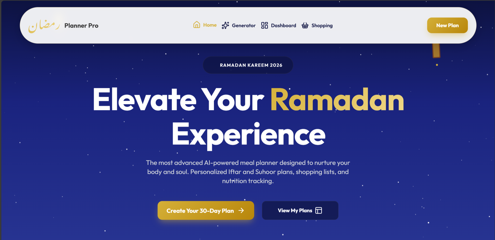
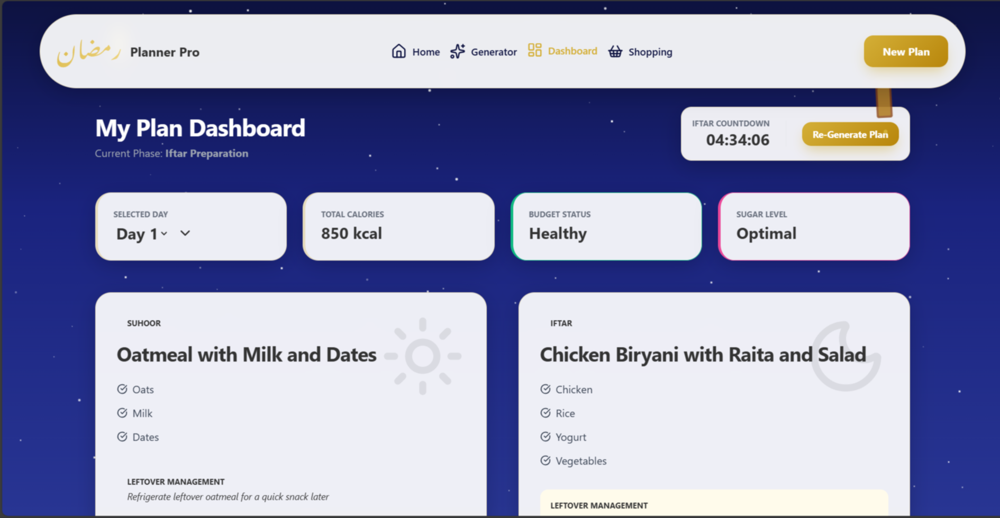
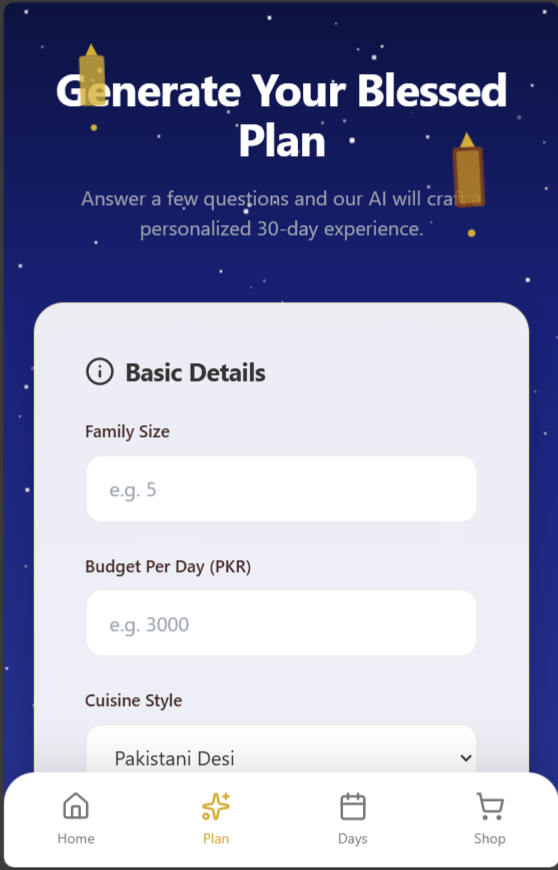

<div align="center">
  
</div>

# 🌙 Ramadan Planner Pro
### *Elevate Your Spiritual & Physical Well-being This Ramadan*

Ramadan Planner Pro is an advanced, AI-powered meal management application designed to help families organize their Iftar and Suhoor experiences. By leveraging the power of GPT-3.5, it creates personalized 30-day meal plans based on your family size, budget, and dietary preferences—all within a stunning, premium interface.

---

## ✨ Key Features

- 🤖 **AI-Driven Meal Generation**: Custom 30-day plans tailored to your specific budget (PKR), family size, and cuisine style.
- 🥗 **Nutritional Insights**: Stay energized with detailed tracking for protein, hydration, and nutritional balance.
- ♻️ **Zero Waste Management**: Built-in AI tips for utilizing leftovers and reducing food waste.
- 🛒 **Automated Shopping Lists**: Categorized ingredient lists based on your generated meal plan.
- 🕯️ **Immersive UI/UX**: A dark-themed, premium experience featuring smooth animations and glassmorphism.
- ⚡ **No API Keys Required**: Integrated GPT-3.5 connectivity means you can start planning immediately without any configuration.

---

## 📸 visual Gallery

### 🚀 Smart Planning Experience
<div align="center">
  
  
  
</div>

<br>

### 📱 Fully Responsive Design
<div align="center">
  
</div>

---

## 🛠️ Technology Stack

- **Frontend**: HTML5, Vanilla JavaScript (ES6+)
- **Styling**: [Tailwind CSS](https://tailwindcss.com/)
- **Icons**: [Lucide Icons](https://lucide.dev/)
- **AI Intelligence**: GPT-3.5 (via BuildPicoApps AI Bridge)
- **Local Storage**: For persistent user data and session management

---

## 🔌 API & Integration

One of the best things about this project is that **No API Integration is needed** manually from the user's end. 

The application uses an integrated AI bridge that connects directly to **GPT-3.5**. You don't need to worry about setting up OpenAI API keys or managing environment variables for the core logic to work. Simply open the app and start generating.

---

## 🚀 Getting Started

1. Clone the repository:
   ```bash
   git clone https://github.com/your-username/ramadan-planner-pro.git
   ```
2. Navigate to the project folder.
3. Open `index.html` in your favorite browser.

---

## 🤝 Contributing

Contributions are what make the open source community such an amazing place to learn, inspire, and create. Any contributions you make are **greatly appreciated**.

1. Fork the Project
2. Create your Feature Branch (`git checkout -b feature/AmazingFeature`)
3. Commit your Changes (`git commit -m 'Add some AmazingFeature'`)
4. Push to the Branch (`git push origin feature/AmazingFeature`)
5. Open a Pull Request

---

## 📜 License

Distributed under the MIT License. See `LICENSE` for more information.

<div align="center">
  <p>Made with ❤️ for the Global Muslim Community</p>
  <p><b>Munib Jahangir</b></p>
</div>
